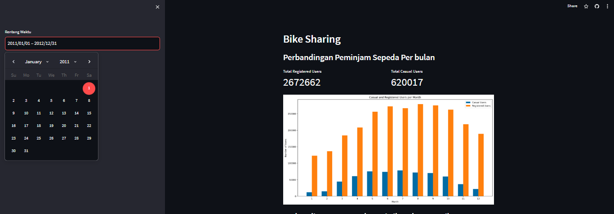
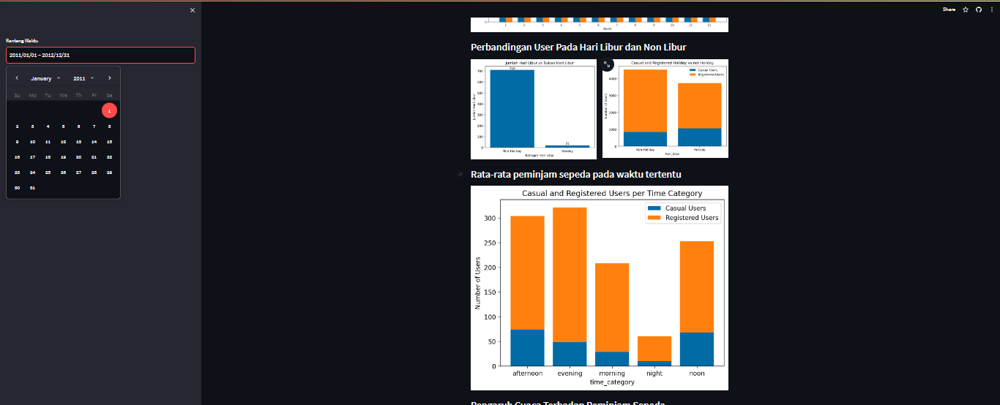
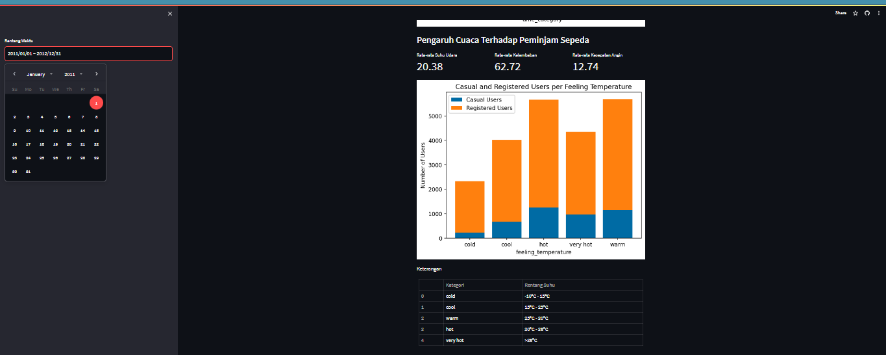
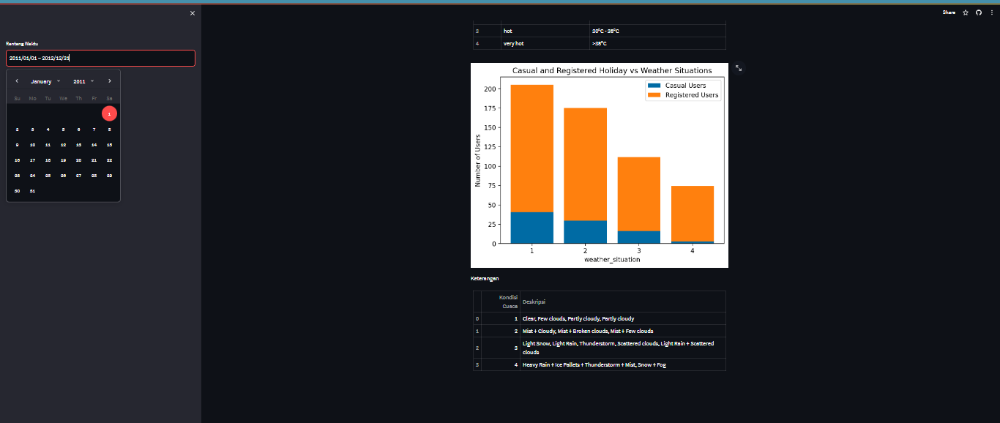

# Bike Sharing Dataset ✨

## Setup Environment
1. Create a virtual environment  
`python -m venv venv`
2. Activate the virtual environment 
`venv\Scripts\Activate.ps1`
3. Install the requirements package 
`pip install numpy pandas matplotlib seaborn jupyter streamlit babel`

## Run steamlit app
1. open dashboard directory
2. run the streamlit app.  
`streamlit run dashboard.py`

## Deployed Streamlit App
1. link to the streamlit app 
[Streamlit Dahboard](https://bike-sharing-dataset-dqpc4dhyzpuk2vmhzmbjdf.streamlit.app/)

2. Screenshot of the Image

